# Azure Active Directory Domain Services (AD DS)

A fully functional Active Directory Domain Services environment deployed in Microsoft Azure, featuring a domain controller, IIS web server, and Windows 10 client VM — each isolated in their own virtual network with VNet peering, secure Bastion access, custom DNS configuration, and end-to-end FQDN resolution verified from a domain-joined client.

---

## Project Overview

| Field | Details |
|---|---|
| **Cloud Provider** | Microsoft Azure |
| **Core Services** | Virtual Machines, Virtual Networks, VNet Peering, Azure Bastion, Active Directory DS, IIS, DNS |
| **VMs Deployed** | `dc-vm` (Windows Server 2019), `web-vm` (Windows Server 2019), `client-vm` (Windows 10 Enterprise) |
| **Domain** | `apatel638.CLO700.com` |
| **Network Architecture** | 3 isolated VNets fully peered in a mesh topology |
| **Access Method** | Azure Bastion (no public IPs on any VM) |
| **Web Server** | IIS with custom `index.html` |
| **DNS** | AD-integrated DNS with custom A record for FQDN resolution |
| **Final Verification** | IIS website accessed via `webserver.apatel638.clo700.com` from domain-joined client |

---

## Architecture

```
┌──────────────────────────────────────────────────────────────────────────┐
│                        Azure Resource Group                              │
│                       CLO700-project1-rg (East US)                      │
│                                                                          │
│  ┌─────────────────────┐   Peering   ┌─────────────────────┐            │
│  │   CLO700-vnet1      │◄───────────►│   CLO700-vnet2      │            │
│  │   110.110.110.0/25  │             │   10.0.1.0/24       │            │
│  │                     │             │                     │            │
│  │  ┌───────────────┐  │             │  ┌───────────────┐  │            │
│  │  │    dc-vm      │  │             │  │    web-vm     │  │            │
│  │  │ Windows       │  │             │  │ Windows       │  │            │
│  │  │ Server 2019   │  │             │  │ Server 2019   │  │            │
│  │  │ D2s v3        │  │             │  │ D2s v3        │  │            │
│  │  │ 110.110.110.4 │  │             │  │ 10.0.1.4      │  │            │
│  │  │ AD DS + DNS   │  │             │  │ IIS (port 80) │  │            │
│  │  └───────────────┘  │             │  └───────────────┘  │            │
│  │  ┌───────────────┐  │             └─────────────────────┘            │
│  │  │ CLO700-bastion│  │                      ▲                         │
│  │  │ (Bastion host)│  │                      │ Peering                 │
│  │  └───────────────┘  │                      ▼                         │
│  └─────────────────────┘             ┌─────────────────────┐            │
│            ▲                         │   CLO700-vnet3      │            │
│            │ Peering                 │   10.0.2.0/24       │            │
│            └────────────────────────►│                     │            │
│                                      │  ┌───────────────┐  │            │
│                                      │  │  client-vm    │  │            │
│                                      │  │ Windows 10    │  │            │
│                                      │  │ Enterprise    │  │            │
│                                      │  │ 10.0.2.4      │  │            │
│                                      │  └───────────────┘  │            │
│                                      └─────────────────────┘            │
│                                                                          │
│  DNS Flow: client-vm → 110.110.110.4 (dc-vm) → resolves webserver FQDN │
│  Access:   All VMs accessed via Azure Bastion (no public IPs)           │
└──────────────────────────────────────────────────────────────────────────┘
```

---

## Azure Services & Resources

| Service | Resource Name | Purpose |
|---|---|---|
| **Resource Group** | `CLO700-project1-rg` | Contains all project resources |
| **Virtual Network 1** | `CLO700-vnet1` (110.110.110.0/25) | Hosts dc-vm and Azure Bastion |
| **Virtual Network 2** | `CLO700-vnet2` (10.0.1.0/24) | Hosts web-vm |
| **Virtual Network 3** | `CLO700-vnet3` (10.0.2.0/24) | Hosts client-vm |
| **VNet Peering** | Full mesh (vnet1↔vnet2, vnet1↔vnet3, vnet2↔vnet3) | Cross-network VM communication |
| **Azure Bastion** | `CLO700-bastion` | Secure RDP/SSH without public IPs |
| **VM — Domain Controller** | `dc-vm` (Standard D2s v3) | Runs AD DS + DNS for the domain |
| **VM — Web Server** | `web-vm` (Standard D2s v3) | Hosts IIS website |
| **VM — Client** | `client-vm` (Standard D2s v3) | Domain-joined Windows 10 test machine |
| **Active Directory** | Domain: `apatel638.CLO700.com` | Identity and DNS authority |
| **IIS** | Installed on web-vm | Serves custom HTML over HTTP port 80 |
| **NSG Rule** | `Allow-HTTP` (port 80 inbound) | Permits web traffic to web-vm |

---

## Repository Structure

```
azure-active-directory-domain-services/
├── README.md
└── screenshots/
    ├── azure-adds-1.jpg
    ├── azure-adds-2.jpg
    ├── azure-adds-3.jpg
    ├── azure-adds-4.jpg
    ├── azure-adds-5.jpg
    ├── azure-adds-6.jpg
    ├── azure-adds-7.jpg
    ├── azure-adds-8.jpg
    ├── azure-adds-9.jpg
    ├── azure-adds-10.jpg
    ├── azure-adds-11.jpg
    ├── azure-adds-12.jpg
    ├── azure-adds-13.jpg
    ├── azure-adds-14.jpg
    ├── azure-adds-15.jpg
    ├── azure-adds-16.jpg
    ├── azure-adds-17.jpg
    └── azure-adds-18.jpg
```

---

## Step-by-Step Setup

### Step 1 — Resource Group

Created the resource group `CLO700-project1-rg` in East US as the container for all project resources. Keeping everything in a single resource group simplifies access control and makes cleanup straightforward — deleting the group removes all child resources at once.

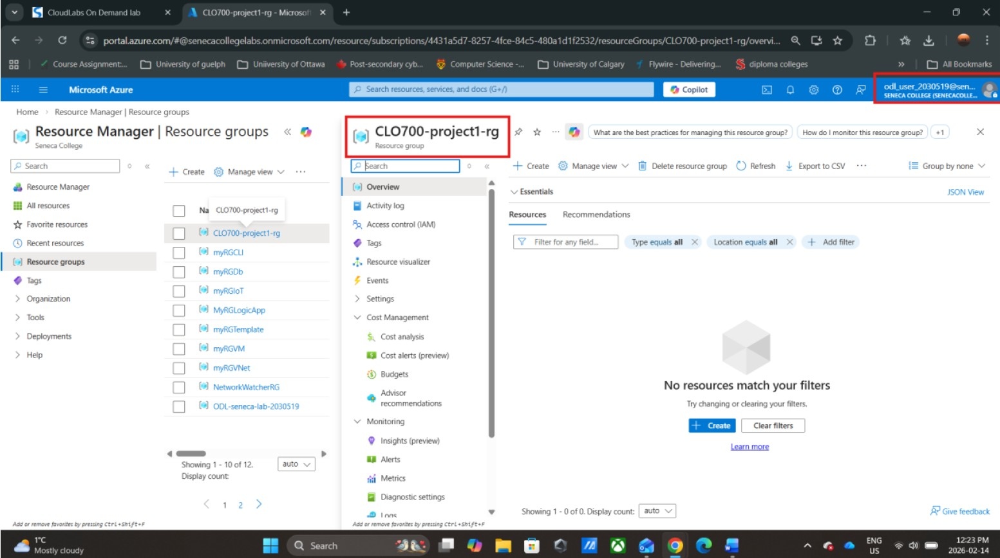

---

### Step 2 — Virtual Networks

Three virtual networks were deployed with separate, non-overlapping address spaces to simulate a real segmented enterprise network. Each VM type lives in its own network — the domain controller and Bastion in vnet1, the web server in vnet2, and the client in vnet3. Isolating them by function means traffic between them must cross the peering links explicitly, matching how production AD environments are structured.

| VNet | Address Space | Subnet | Purpose |
|---|---|---|---|
| `CLO700-vnet1` | 110.110.110.0/25 | vnet1-subnet1, AzureBastionSubnet | Domain Controller + Bastion |
| `CLO700-vnet2` | 10.0.1.0/24 | vnet2-subnet1 | Web Server |
| `CLO700-vnet3` | 10.0.2.0/24 | vnet3-subnet1 | Client VM |

---

### Step 3 — VNet Peering

Configured a full mesh of VNet peerings so all three networks can communicate directly. Without peering, VMs in separate VNets are completely isolated even within the same region — there is no default routing between them. Each peering link was verified as **Fully Synchronized** and **Connected** from both sides.

**vnet1 peerings — connections to vnet2 and vnet3:**

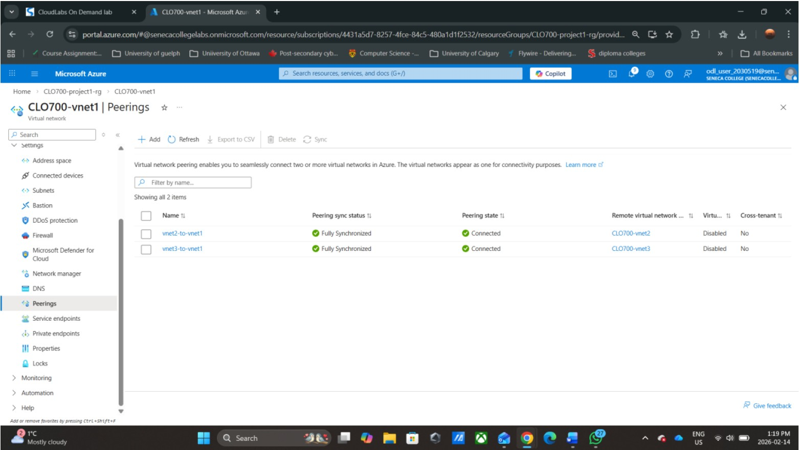

**vnet3 peerings — confirming full mesh from the client network:**

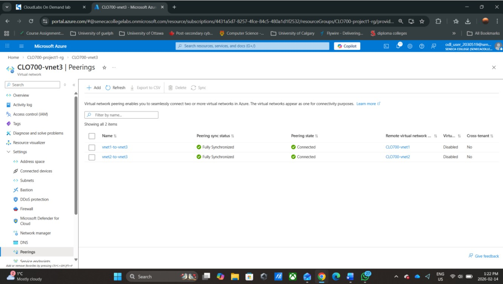

---

### Step 4 — Azure Bastion

Deployed `CLO700-bastion` into the `AzureBastionSubnet` of vnet1. Azure Bastion provides browser-based RDP access to all VMs through the Azure portal without requiring any VM to have a public IP address. This is the recommended access pattern for production workloads — it eliminates RDP exposure on the public internet entirely.

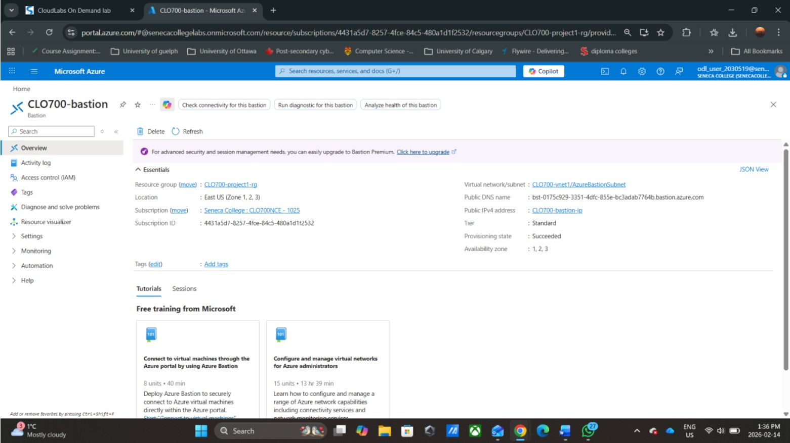

---

### Step 5 — Domain Controller VM (dc-vm)

**Initial deployment failure:** The first attempt to deploy `dc-vm` failed with a Conflict/Failed provisioning state due to an availability zone constraint. Azure still created orphaned NIC and NSG resources. These were manually deleted before redeploying without a forced availability zone.

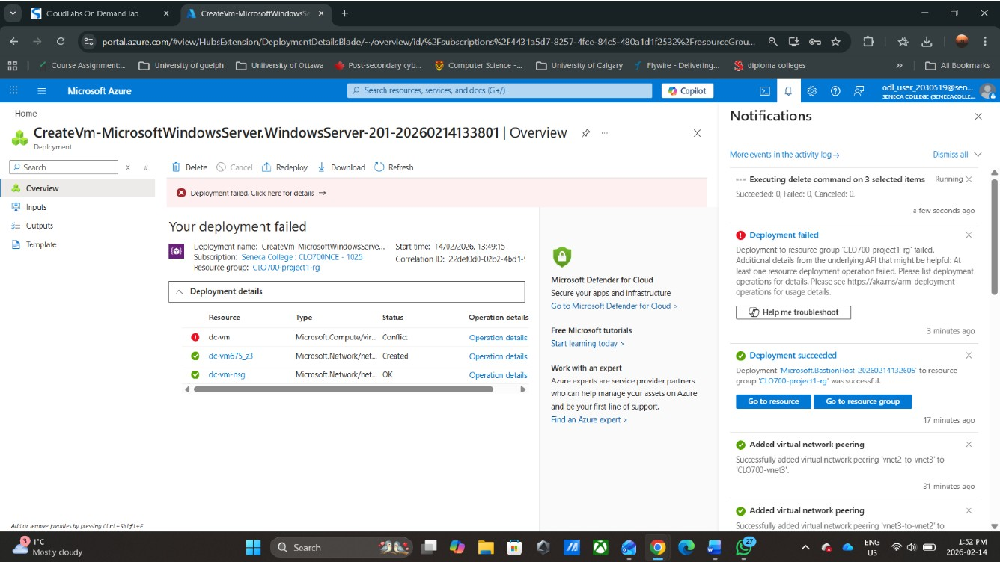

**Successful deployment:** Redeployed `dc-vm` using Windows Server 2019 Datacenter Gen2, Standard D2s v3 (2 vCPUs, 8 GB RAM) — upgraded from the default B1s because AD DS requires more memory headroom. Placed in CLO700-vnet1/vnet1-subnet1 with no public IP.

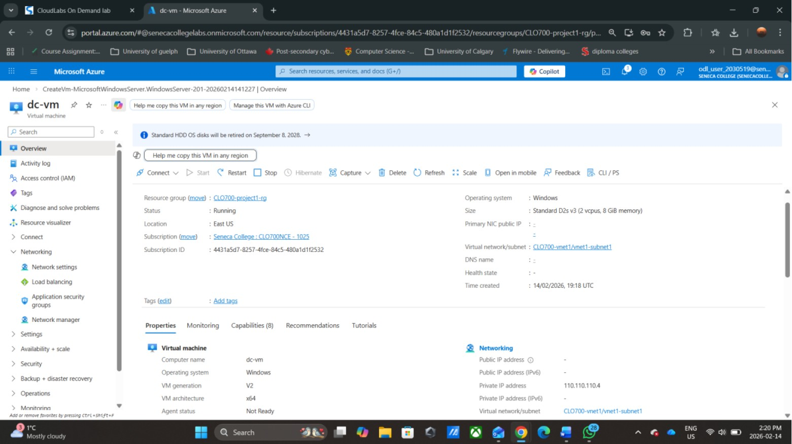

---

### Step 6 — Install and Promote AD DS

Connected to dc-vm via Azure Bastion and used Server Manager to add the **Active Directory Domain Services** role. After role installation, ran the AD DS Configuration Wizard to promote dc-vm into a domain controller for the new forest `apatel638.CLO700.com`.

**AD DS role selected in Server Manager:**

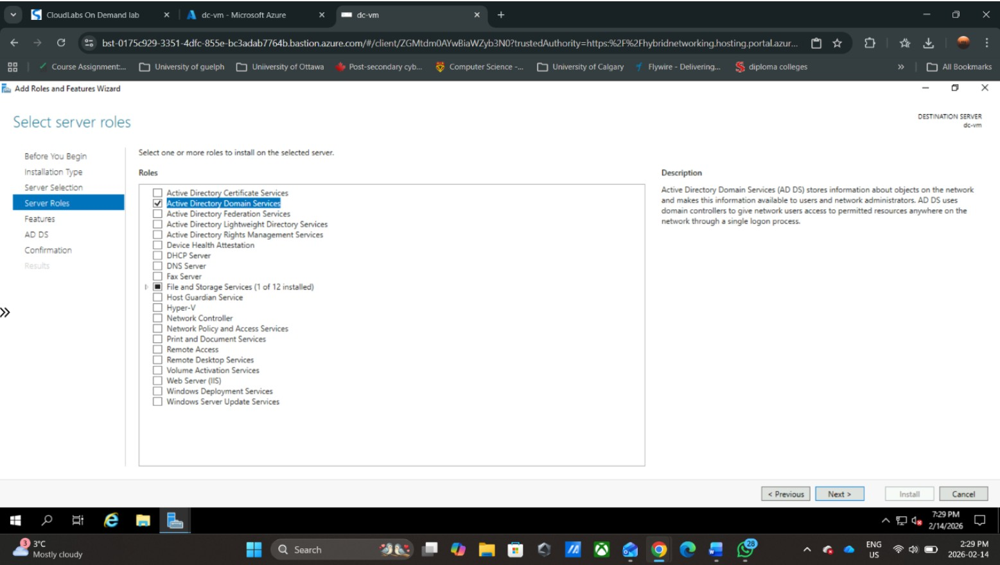

**Domain controller promotion complete — Server Manager confirming domain:**

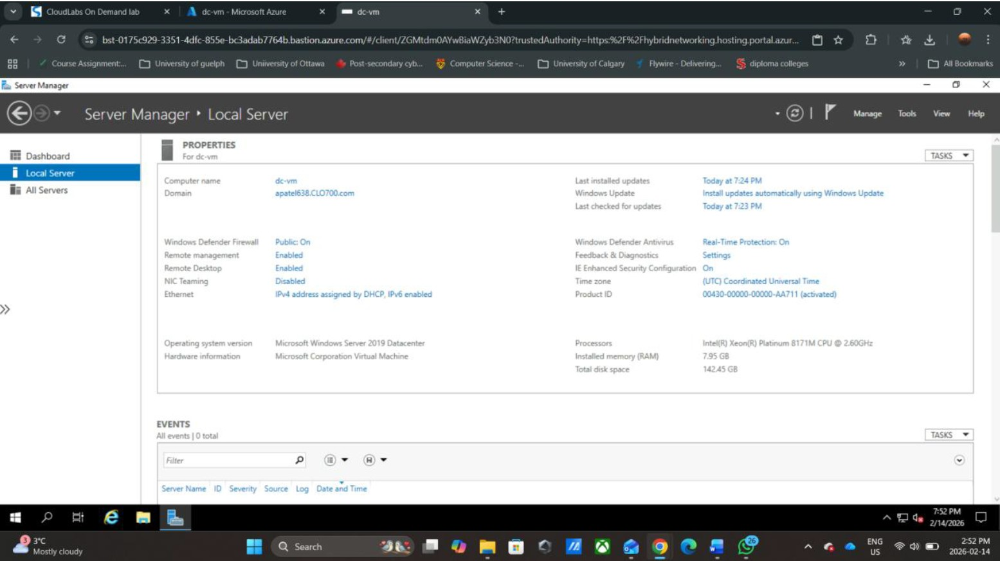

---

### Step 7 — Web Server VM (web-vm)

Deployed `web-vm` using Windows Server 2019 Datacenter Gen2 into CLO700-vnet2/vnet2-subnet1 with no public IP. Initially deployed as Standard B1s, but this caused Server Manager to crash repeatedly during IIS installation. Resized to Standard D2s v3 to resolve the instability.

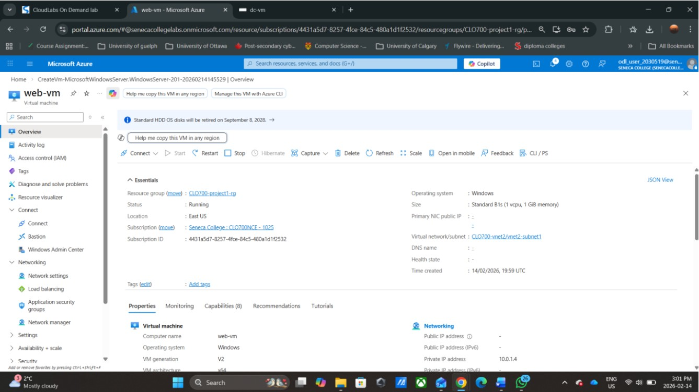

---

### Step 8 — Install IIS

Connected to web-vm via Bastion and installed the **Web Server (IIS)** role through Server Manager's Add Roles and Features Wizard. After installation, created a custom `index.html` in `C:\inetpub\wwwroot` to replace the default IIS page.

**IIS installation in progress:**

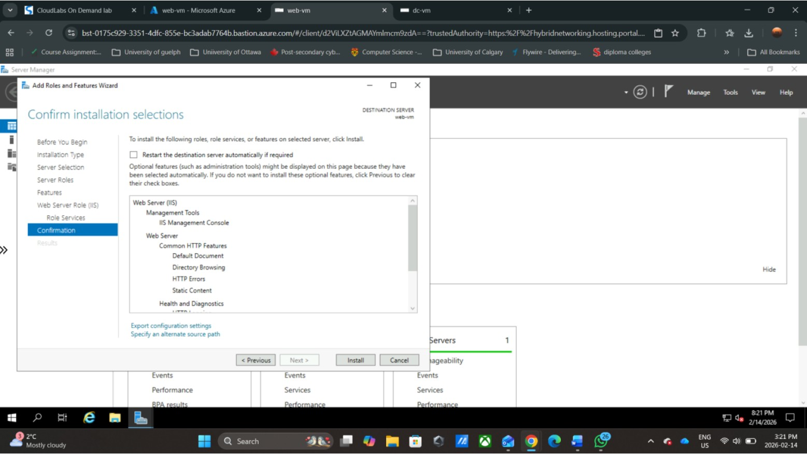

**Custom webpage (`index.html`):**

```html
<!DOCTYPE html>
<html>
  <head>
    <title>My IIS Web Server</title>
  </head>
  <body>
    <h1>Welcome to My Web Server!</h1>
    <p>This page is hosted on IIS running in Microsoft Azure.</p>
    <p>Server Name: web-vm</p>
  </body>
</html>
```

---

### Step 9 — NSG Rule — Allow HTTP Port 80

Added an inbound security rule to the web-vm NSG to permit HTTP traffic on port 80. Without this rule, the NSG blocks all inbound traffic by default — IIS would be running but unreachable from other VMs on the network.

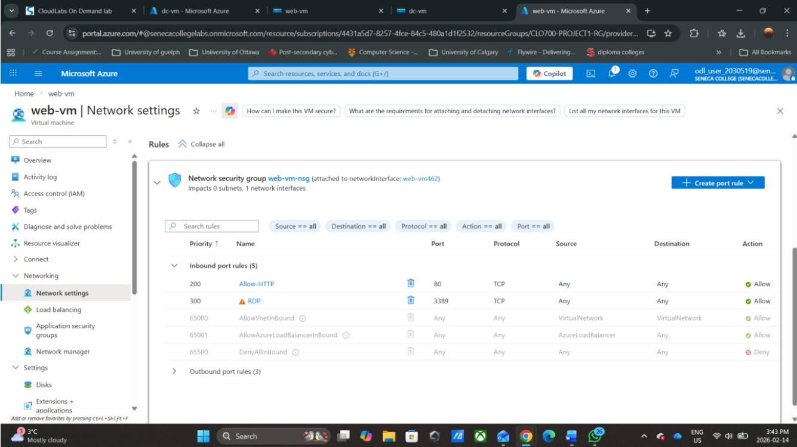

---

### Step 10 — Configure DNS on web-vm

Set the web-vm network interface to use a **Custom DNS server** pointing to the dc-vm private IP (`110.110.110.4`). This is required so web-vm can resolve domain names through the AD-integrated DNS server rather than Azure's default resolver, which has no knowledge of the `apatel638.CLO700.com` zone.

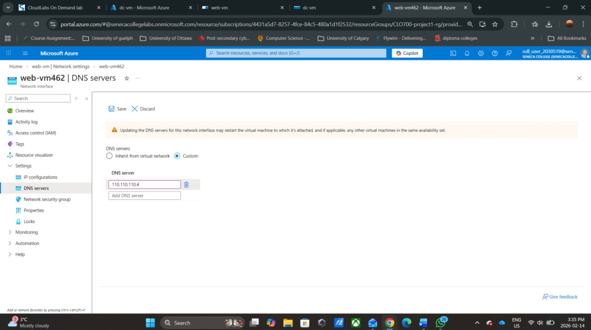

---

### Step 11 — Create DNS A Record (FQDN)

Inside the Domain Controller's DNS Manager, created a new Host (A) record under the `apatel638.CLO700.com` forward lookup zone mapping hostname `webserver` to the web-vm private IP `10.0.1.4`. This creates the FQDN `webserver.apatel638.CLO700.com` resolvable by all domain members.

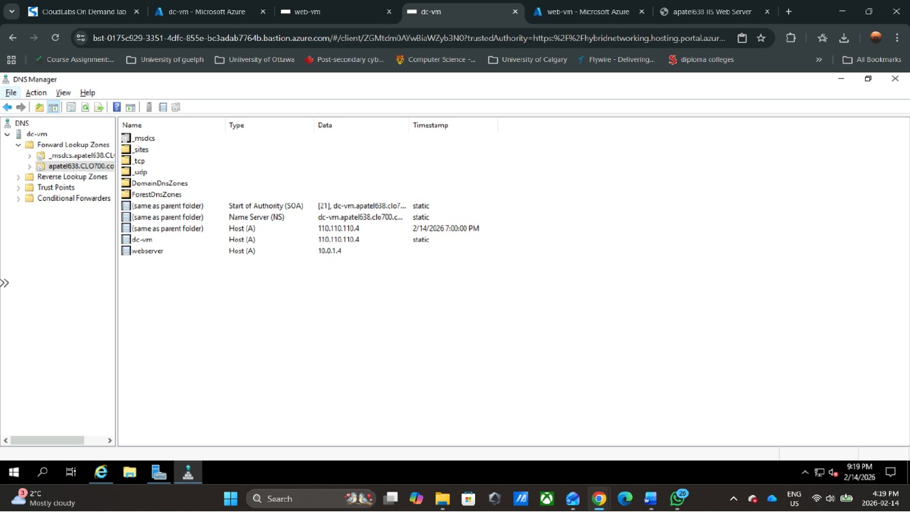

---

### Step 12 — Join web-vm to the Domain

Configured web-vm System Properties to join the domain `apatel638.CLO700.com`. After providing domain administrator credentials and restarting, verified the join:

```cmd
systeminfo | findstr Domain
Domain:    apatel638.CLO700.com
```

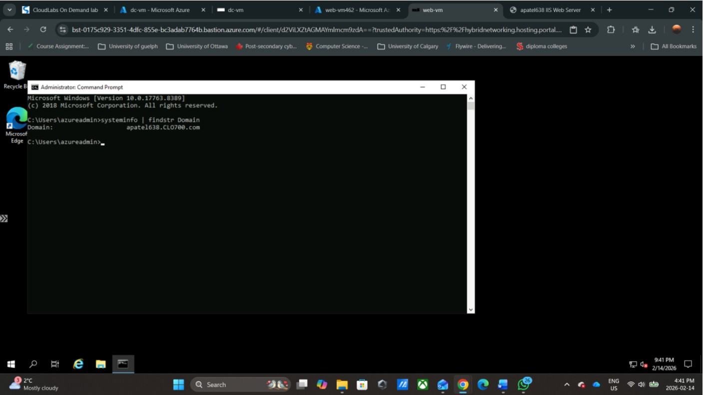

---

### Step 13 — Deploy client-vm and Configure DNS

Deployed `client-vm` using Windows 10 Enterprise multi-session Gen2 into CLO700-vnet3/vnet3-subnet1 with no public IP. Set the NIC DNS server to `110.110.110.4` (dc-vm) so it can resolve AD names before joining the domain.

---

### Step 14 — Join client-vm to the Domain

Connected to client-vm via Bastion and verified DNS resolution of both the domain and the webserver FQDN before proceeding with the domain join.

**nslookup confirming both records resolve correctly through the DC:**

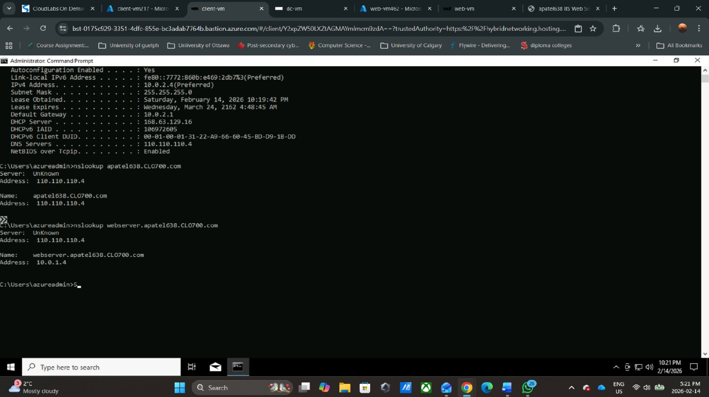

**Domain join dialog with administrator credentials:**

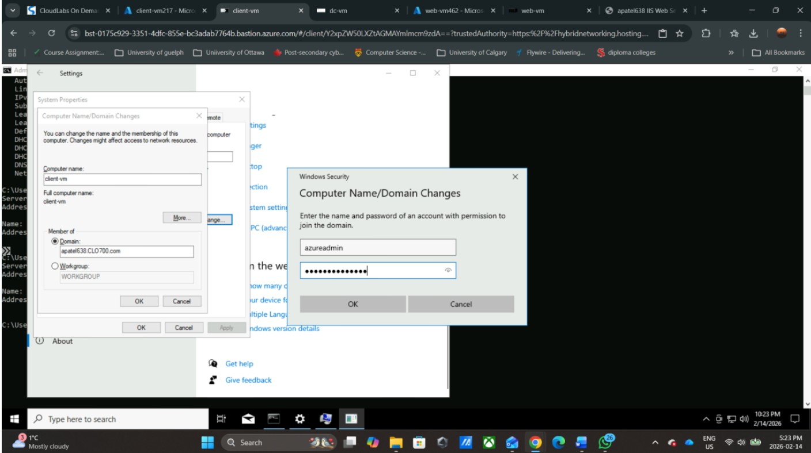

After restart, verified membership:

```cmd
systeminfo | findstr Domain
Domain:    apatel638.CLO700.com
```

---

### Step 15 — Pipeline Verification

**Active Directory — Both VMs domain-joined:**

Active Directory Users and Computers on dc-vm confirms both `web-vm` and `client-vm` appear as Computer objects under the domain.

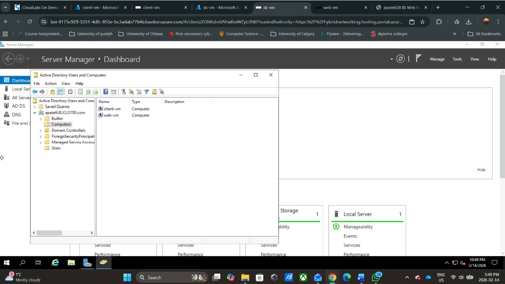

**IIS website accessed via FQDN from client-vm:**

The custom IIS webpage loads in the browser on client-vm using the full domain name `webserver.apatel638.clo700.com` — confirming VNet peering, DNS resolution, domain membership, NSG rules, and IIS are all working end-to-end.

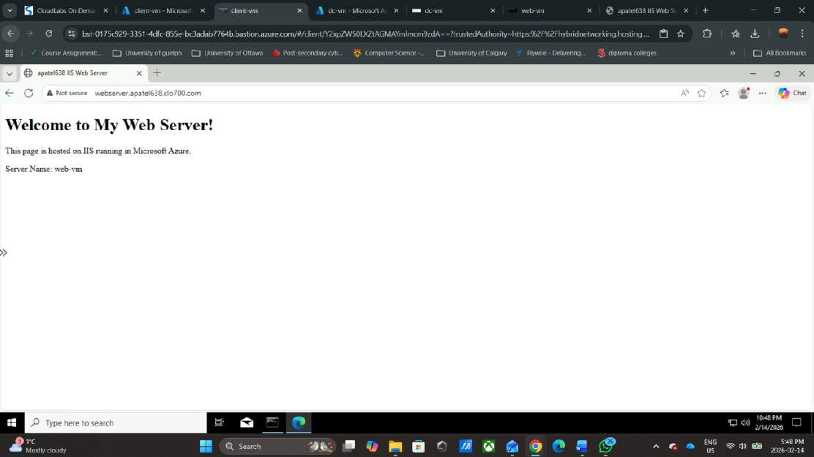

---

## Challenges & Solutions

| Challenge | Root Cause | Solution |
|---|---|---|
| dc-vm deployment failed with Conflict/Failed provisioning state | Availability zone constraint caused the VM to fail mid-deployment, leaving orphaned NIC and NSG resources | Deleted leftover resources, redeployed without forcing an availability zone |
| Server Manager and IIS installation crashing repeatedly on web-vm | Default VM size Standard B1s (1 vCPU, 1 GB RAM) too small to run Windows Server workloads | Resized web-vm to Standard D2s v3 (2 vCPUs, 8 GB RAM) before retrying the IIS role installation |
| nslookup returning "Non-existent domain" on first test from web-vm | web-vm NIC was using Azure's default DNS resolver, which has no knowledge of the AD zone | Changed web-vm NIC DNS to Custom, pointing to dc-vm private IP 110.110.110.4 |
| FQDN resolution failing from client-vm before domain join | client-vm NIC was also using Azure default DNS, not the DC | Set client-vm NIC DNS server to 110.110.110.4 before attempting domain join |
| web-vm still showing WORKGROUP after DNS was resolving correctly | DNS resolution and domain membership are separate operations — resolving the domain does not join it | Explicitly joined the domain via System Properties → Computer Name → Change → Domain |

---

## Key Learnings

**VNet peering is not transitive.** Connecting vnet1↔vnet2 and vnet1↔vnet3 does not allow vnet2 and vnet3 to communicate with each other. A full mesh of three networks requires three separate peering relationships — missing one silently breaks cross-network connectivity in ways that are hard to diagnose.

**Azure's default DNS resolver cannot resolve Active Directory zones.** Every VM needed its NIC DNS manually pointed at the domain controller. Azure's built-in resolver has no awareness of privately hosted AD zones — this was the cause of every nslookup failure encountered during the project and is one of the most common misconfigurations when deploying AD DS in Azure.

**VM sizing matters for Windows Server workloads.** Standard B1s is sufficient for lightweight Linux but consistently causes crashes during Windows Server Manager operations, AD DS promotion, and IIS role installation. Standard D2s v3 should be the minimum for any Windows Server performing domain services or role installations.

**Failed Azure deployments leave orphaned resources.** When a VM deployment fails mid-way, Azure has already provisioned supporting resources like NICs and NSGs. These cause Conflict errors on redeployment if not explicitly deleted. Always inspect the resource group for leftover artifacts before retrying a failed deployment.

**DNS configuration must precede domain join.** A VM cannot join a domain it cannot resolve. Setting the custom DNS server on the NIC — and restarting the VM for it to take effect — must happen before the domain join attempt, not after.

**Azure Bastion removes the need for public IPs on internal VMs.** By deploying Bastion in the primary VNet with peering to all others, every VM in the environment is accessible through the portal without any public IP or open RDP port. This is the correct security posture for AD environments in Azure and eliminates a significant attack surface.

---

## Related Projects

| # | Project | Repo |
|---|---|---|
| 1 | Two-Tier Terraform Web App | `aws-terraform-two-tier-webapp` |
| 2 | EC2 Web Server Deployment | `aws-ec2-webserver-deployment` |
| 3 | News API Lambda + S3 | `aws-news-api-lambda` |
| 4 | AWS Event-Driven Bills Pipeline | `aws-event-driven-bills-pipeline` |
| 5 | **Azure Active Directory Domain Services** | `azure-active-directory-domain-services` ← you are here |
